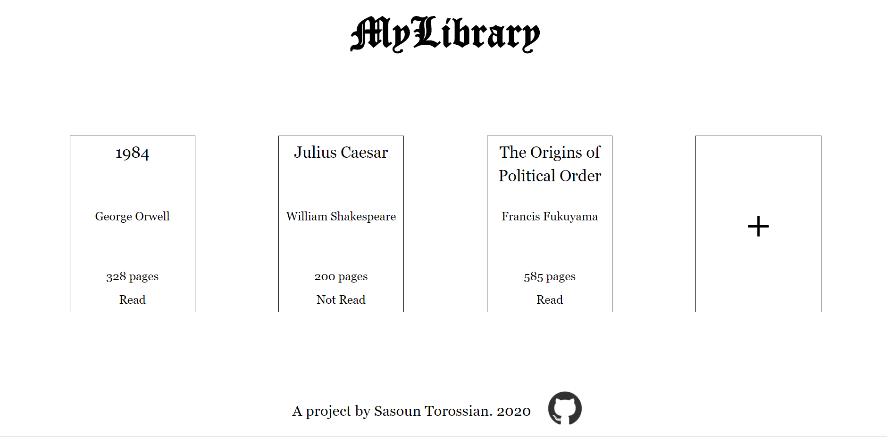

# Library
Library app based off the Odin Project curriculum. Users can add and remove books they have in their library. Books can be toggled betwen read and non-read modes. Live demo can be found on github.io [here](https://sasountorossian.github.io/Library/).

Project was introduction to objects and their creation. Relatively simple and fun to implement, though learning local storage took some time. Storage was made easier by creating dedicated save and load functions.

First introduction to modal forms as well, which allows for hidden forms to pop up when required. Used online tutorials to make inputs a lot more interesting and stylish. Still don't fully undestand what is happening though.

Very happy with design as it was a priority early when starting. Devided to go for a card design with a minimalistic black-and-white aesthetic. Stopped the look from getting to boring by adding some animations. 

Project was a fun way to learn about objects and object manipulation via the dom. Also a good opportunity to brush up on design skills.
